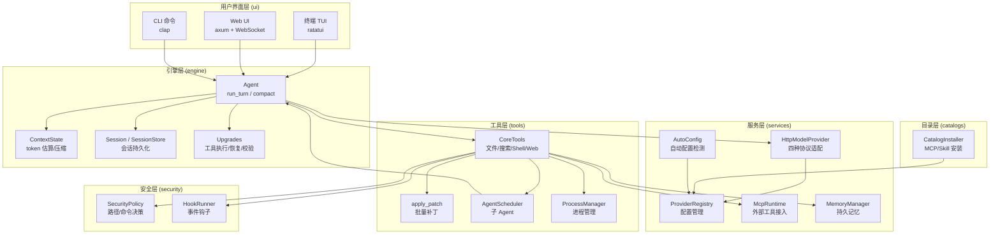
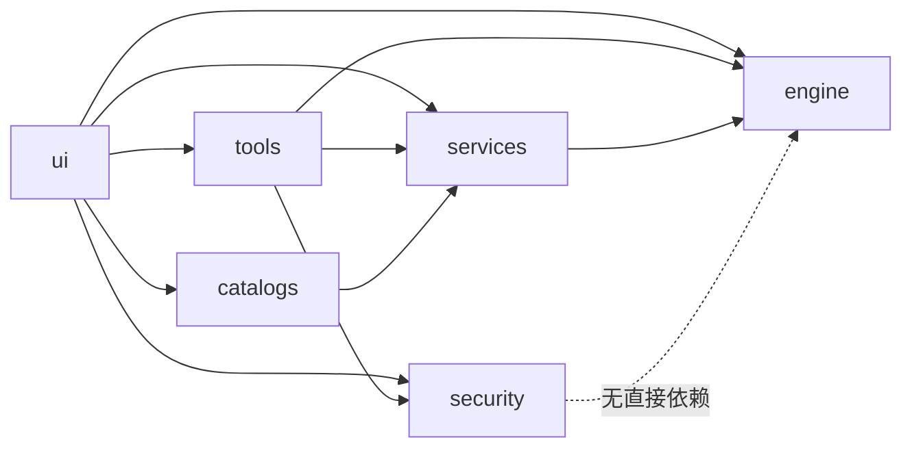

# Coomi Rust — Code Wiki

---

## 1. 项目概述

### 1.1 项目名称与简介

**Coomi Rust** (`coomi-rs`) 是一个用 Rust 编写的紧凑型终端编码 Agent（Terminal Coding Agent），版本 2.0.0。它以六个 workspace crate 的形式组织，实现了从 LLM 对话循环、工具调用、安全策略到终端/Web 交互界面的完整功能。

### 1.2 主要功能

- **Agent 对话循环**：支持多轮工具调用、自动上下文压缩、空响应/纯推理响应重试恢复
- **多 Provider 适配**：统一接口对接 OpenAI Compatible、OpenAI Responses、Anthropic Messages、Gemini Native 四种协议
- **内置工具集**：文件读写编辑、目录搜索、Shell 执行、Web 搜索、图片查看、Patch 应用、子 Agent 调度、进程管理等
- **MCP 客户端**：支持 stdio / HTTP / SSE 三种传输协议的外部 MCP Server 接入
- **Skill 系统**：可安装的 Skill 目录，按需加载 SKILL.md 指令
- **Memory 持久记忆**：三级作用域（Local / Project / Global）的 Markdown 记忆存储
- **安全策略**：工作区边界、访问模式（ReadOnly / WorkspaceWrite / FullAccess）、破坏性命令拦截
- **Hooks 系统**：会话/轮次/工具使用前后事件钩子
- **上下文管理**：自适应自动压缩、Provider usage 基线、token 估算、历史裁剪
- **会话管理**：JSON 持久化、原子写入、会话列表/恢复/切换模型
- **双 UI**：ratatui 全屏终端界面 + axum Web 界面（WebSocket 实时通信）
- **Loop 自主循环**：Agent 可启动自主目标驱动循环，带 token 预算和时间追踪
- **Plan 计划追踪**：Agent 可创建和更新多步骤计划
- **Catalog 目录**：内置可安装的 MCP Server 和 Skill 目录

### 1.3 技术栈

| 类别 | 技术 |
|---|---|
| 语言 | Rust 2024 edition（要求 1.85+） |
| 异步运行时 | Tokio（multi-thread） |
| HTTP 客户端 | reqwest（rustls-tls） |
| Web 框架 | axum 0.8（含 WebSocket） |
| 终端 UI | ratatui 0.29 + crossterm 0.28 |
| 序列化 | serde + serde_json + serde_yaml |
| CLI 解析 | clap 4（derive） |
| 文件搜索 | ignore（gitignore 感知） |
| 正则 | regex |
| 文本渲染 | pulldown-cmark（Markdown） |
| 压缩 | zip（deflate） |
| 其他 | chrono、uuid、md5、fs2、dirs、tempfile、unicode-width、futures-util、tower-http |

### 1.4 适用场景与目标用户

面向开发者的本地编码助手，适用于：
- 在终端中直接与 LLM 对话进行代码编写、调试、重构
- 需要文件操作、Shell 执行、Web 搜索等工具能力的编码 Agent
- 需要 MCP 扩展和 Skill 指令增强的场景
- 支持 Android（Termux）和桌面（Linux/macOS/Windows）跨平台使用

---

## 2. 目录结构说明

```
coomi-rs/
├── Cargo.toml                  # Workspace 根配置，定义 6 个 member crate
├── Cargo.lock                  # 依赖锁定文件
├── README.md                   # 项目说明文档
├── rust-toolchain.toml         # Rust 工具链版本要求
├── rustfmt.toml                # 代码格式化配置
│
├── engine/                     # 核心 Agent 引擎
│   ├── Cargo.toml
│   └── src/
│       ├── lib.rs              # 公共 API 导出
│       ├── agent.rs            # Agent 主循环（run_turn / compact_session）
│       ├── context.rs          # 上下文管理（token 估算、历史裁剪、压缩）
│       ├── types.rs            # 核心类型定义（消息、工具、事件、Provider trait）
│       ├── session.rs          # 会话持久化（Session / SessionStore）
│       ├── instructions.rs     # 项目指令发现（AGENTS.md / COOMI.md）
│       ├── input_queue.rs      # 忙时输入队列
│       └── upgrades/           # Agent 循环增强策略
│           ├── mod.rs
│           ├── tool_execution.rs   # 工具并行执行、去重、输出裁剪
│           ├── tool_policy.rs      # 工具并行安全分类
│           ├── tool_validation.rs  # 工具调用参数校验
│           ├── context_guard.rs    # 上下文压力分级与告警
│           ├── model_recovery.rs   # 空响应/纯推理响应恢复
│           └── policy.rs           # UpgradePolicy 常量定义
│
├── services/                   # Provider 适配与配置服务
│   ├── Cargo.toml
│   └── src/
│       ├── lib.rs              # 公共 API 导出
│       ├── provider.rs         # HttpModelProvider（四种协议的请求/响应适配）
│       ├── config.rs           # ProviderRegistry / ProviderConfig / ProviderDocument
│       ├── mcp.rs              # MCP 客户端运行时（stdio / HTTP / SSE）
│       ├── memory.rs           # MemoryManager（三级作用域记忆管理）
│       ├── auto_config.rs      # 自动配置检测（粘贴 JSON 自动识别）
│       ├── catalog_state.rs    # MCP/Skill 安装状态管理
│       ├── provider_error.rs   # Provider HTTP 错误分类
│       └── update.rs           # GitHub Release 更新检查
│
├── tools/                      # 内置工具实现
│   ├── Cargo.toml
│   └── src/
│       ├── lib.rs              # CoreTools（文件/搜索/Shell/Web/Memory 等全部工具）
│       ├── patch.rs            # apply_patch（批量文件增删改补丁）
│       ├── agents.rs           # AgentScheduler（子 Agent 调度）
│       └── processes.rs        # ProcessManager（长运行进程管理）
│
├── security/                   # 安全策略与钩子
│   ├── Cargo.toml
│   └── src/
│       ├── lib.rs              # SecurityPolicy（路径/命令访问决策）
│       └── hooks.rs            # HookRunner（事件钩子执行引擎）
│
├── ui/                         # 用户界面
│   ├── Cargo.toml
│   └── src/
│       ├── main.rs             # CLI 入口（clap 解析、命令路由）
│       ├── onboarding.rs       # 首次使用引导（交互式 Provider 配置）
│       ├── web.rs              # Web UI 后端（axum REST + WebSocket API）
│       └── terminal_ui/        # 终端全屏界面
│           ├── mod.rs          # TUI 主逻辑（事件处理、命令系统）
│           ├── render.rs       # TUI 渲染布局
│           ├── editor.rs       # 多行编辑器组件
│           └── theme.rs        # 主题配色
│
├── catalogs/                   # 可安装目录
│   ├── Cargo.toml
│   ├── mcp.json                # 内置 MCP Server 目录（filesystem/git/memory/playwright/github）
│   ├── skills.json             # 内置 Skill 目录（frontend-design/code-review 等）
│   └── src/
│       └── lib.rs              # CatalogInstaller（MCP/Skill 安装/卸载）
│
└── target/                     # 编译输出（Cargo 生成）
```

---

## 3. 整体架构设计

### 3.1 架构风格

Coomi 采用**分层架构 + 插件化**设计：

- **分层**：engine（核心循环）→ services（Provider 适配）→ tools（工具实现）→ security（安全策略）→ ui（用户界面），上层依赖下层，下层不依赖上层
- **插件化**：通过 `ToolRuntime` trait 实现工具注册，通过 `ModelProvider` trait 实现 Provider 切换，通过 MCP 协议接入外部工具

### 3.2 架构图



### 3.3 数据流向

一次完整的用户交互流程：

```
用户输入 → UI 层接收
  → Agent.run_turn() 启动一轮对话
    → ContextState 估算 token、检查是否需要压缩
    → HttpModelProvider.complete() 发送请求到 LLM
    → 解析响应：文本内容 / 工具调用
    → 若有工具调用：
      → ToolValidator 校验参数
      → SecurityPolicy 评估权限
      → HookRunner 执行 pre_tool_use 钩子
      → CoreTools.call() 执行工具
      → HookRunner 执行 post_tool_use 钩子
      → 工具结果写入 Session.messages
    → 循环直到模型不再请求工具
    → ContextState 更新 token 计数
    → SessionStore.save() 持久化
  → UI 层渲染输出
```

---

## 4. 主要模块职责

| 模块 | 路径 | 职责 | 对外关键接口 | 依赖模块 |
|---|---|---|---|---|
| **engine** | `engine/` | Agent 循环、消息管理、上下文压缩、会话持久化 | `Agent::run_turn()`, `Session`, `ContextState`, `ModelProvider` trait, `ToolRuntime` trait, `ApprovalHandler` trait | — (根 crate) |
| **services** | `services/` | Provider 协议适配、配置管理、MCP 客户端、记忆管理 | `HttpModelProvider::new()`, `ProviderRegistry::load()`, `McpRuntime`, `MemoryManager` | engine |
| **tools** | `tools/` | 内置工具实现（文件、搜索、Shell、Web、子 Agent） | `CoreTools::new()`, `apply_patch()`, `AgentScheduler` | engine, services, security |
| **security** | `security/` | 工作区边界、访问策略、破坏性命令拦截、事件钩子 | `SecurityPolicy::new()`, `HookRunner::load()` | — |
| **ui** | `ui/` | CLI 入口、终端 TUI、Web 后端 | `main()`, Web API 路由 | engine, services, tools, security, catalogs |
| **catalogs** | `catalogs/` | MCP/Skill 目录定义、安装/卸载 | `CatalogInstaller::install_mcp()`, `install_skill()` | services |

---

## 5. 关键类与函数说明

### 5.1 engine 模块

#### `Agent` — `engine/src/agent.rs`

```rust
pub struct Agent { name: String, /* ... */ }
```

- **功能**：Agent 主循环的核心结构体，驱动一轮完整的 LLM 对话（包括工具调用循环）
- **关键方法**：
  - `Agent::new(name: &str) -> Self` — 创建 Agent 实例，可链式配置 `with_input_queue()`
  - `run_turn(&self, session, prompt, provider, tools, approval, observer) -> Result<String>` — 执行一轮完整对话：发送消息 → 接收响应 → 执行工具 → 循环直到完成
  - `compact_session(&self, session, provider, tools, observer) -> Result<()>` — 手动触发上下文压缩
- **在调用链中的角色**：整个系统的核心调度器，被 UI 层调用，协调 Provider、Tools、Context 的交互

#### `Session` — `engine/src/session.rs`

```rust
pub struct Session {
    pub id: Uuid,
    pub provider_id: String,
    pub model: String,
    pub cwd: PathBuf,
    pub messages: Vec<ChatMessage>,
    pub usage: TokenUsage,
    pub context: ContextState,
    pub plan: Option<PlanState>,
    pub loop_state: Option<LoopState>,
    // ...
}
```

- **功能**：一次对话会话的完整状态，包含消息历史、token 用量、上下文状态、计划和循环状态
- **关键方法**：
  - `Session::new(provider_id, model, cwd)` — 创建新会话
  - `switch_model(provider_id, model)` — 运行时切换模型

#### `SessionStore` — `engine/src/session.rs`

```rust
pub struct SessionStore { directory: PathBuf }
```

- **功能**：会话的磁盘持久化管理，使用原子写入（先写 `.tmp` 再 `rename`）防止数据损坏
- **关键方法**：
  - `save(&self, session) -> Result<()>` — 原子写入会话 JSON
  - `load(&self, id) -> Result<Session>` — 加载会话
  - `list(&self, cwd) -> Result<Vec<SessionSummary>>` — 列出会话摘要
  - `latest(&self, cwd) -> Result<Option<Session>>` — 获取最近会话

#### `ContextState` — `engine/src/context.rs`

```rust
pub struct ContextState {
    first_window_id: u64,
    previous_window_id: u64,
    window_id: u64,
    compaction_count: u64,
    // ...
}
```

- **功能**：追踪上下文窗口使用状态，管理 Provider 的缓存窗口 ID，驱动自动压缩决策
- **关键方法**：
  - `status(&self, capabilities) -> ContextStatus` — 计算当前上下文使用百分比
  - `reset_after_compaction(system, messages, tools, capabilities)` — 压缩后重置状态

#### `ModelProvider` trait — `engine/src/types.rs`

```rust
#[async_trait]
pub trait ModelProvider: Send + Sync {
    fn provider_id(&self) -> &str;
    fn model(&self) -> &str;
    fn capabilities(&self) -> ModelCapabilities;
    async fn complete(&self, request: ModelRequest) -> Result<ModelResponse>;
    async fn complete_stream(&self, request, observer) -> Result<ModelResponse>;
    async fn compact(&self, request: CompactionRequest) -> Result<Option<CompactionResponse>>;
}
```

- **功能**：LLM Provider 的统一抽象接口，所有协议适配都实现此 trait
- **在调用链中的角色**：Agent 通过此 trait 与 LLM 通信，不关心具体协议

#### `ToolRuntime` trait — `engine/src/types.rs`

```rust
#[async_trait]
pub trait ToolRuntime: Send + Sync {
    fn specs(&self) -> Vec<ToolSpec>;
    async fn call(&self, call: &ToolCall, approval: &dyn ApprovalHandler) -> ToolResult;
    async fn lifecycle(&self, event: &str, payload: Value) -> Result<Option<String>, String>;
}
```

- **功能**：工具运行时的统一接口，提供工具规格列表和执行入口

#### `AgentEvent` enum — `engine/src/types.rs`

- **功能**：Agent 运行过程中产生的所有事件类型，用于 UI 层观察和渲染
- **变体**：`ModelStarted`, `Text`, `TextDelta`, `ReasoningDelta`, `ContextUpdated`, `CompactionStarted/Completed`, `PlanUpdated`, `LoopUpdated`, `ToolStarted/Finished`, `TurnCompleted` 等

#### 核心辅助函数 — `engine/src/context.rs`

- `normalize_history(messages)` — 修复消息历史中的孤儿 tool 消息和缺失的 tool 结果
- `estimate_request_tokens(system, messages, tools) -> u64` — 按字节长度估算 token 数（÷4）
- `compacted_history(messages, summary)` — 生成压缩后的历史（保留真实用户消息 + 摘要）
- `trim_history_to_fit(system, messages, tools, token_limit)` — 裁剪历史以适配 token 限制

### 5.2 services 模块

#### `HttpModelProvider` — `services/src/provider.rs`

```rust
pub struct HttpModelProvider { /* ... */ }
```

- **功能**：实现 `ModelProvider` trait，处理四种协议的 HTTP 请求/响应转换
- **支持的协议**：
  - `openai_compatible` — 标准 OpenAI Chat Completions API
  - `openai_responses` — OpenAI Responses API（支持远程压缩、原生 web_search）
  - `anthropic_messages` — Anthropic Messages API（含缓存控制、系统消息格式）
  - `gemini_native` — Google Gemini Native API
- **关键方法**：
  - `new(config: ProviderConfig) -> Result<Self>` — 根据配置创建对应协议的 Provider
  - `complete()` / `complete_stream()` — 发送请求并解析响应（支持 SSE 流式）
- **内部函数**：
  - `openai_messages()` / `responses_input()` / `anthropic_messages()` / `gemini_messages()` — 将统一消息格式转换为各协议格式
  - `openai_responses_tools()` — 工具规格转换（含原生 web_search 替换）

#### `ProviderRegistry` — `services/src/config.rs`

```rust
pub struct ProviderRegistry { active: String, providers: BTreeMap<String, ProviderConfig> }
```

- **功能**：从 `providers.json` 加载和管理所有 Provider 配置
- **关键方法**：
  - `load(path) -> Result<Self>` — 从文件加载并验证
  - `resolve(selector) -> Result<ProviderConfig>` — 按 ID 或 `provider:model` 格式解析
  - `choices() -> Vec<ModelChoice>` — 列出所有可选模型

#### `McpRuntime` — `services/src/mcp.rs`

- **功能**：MCP 客户端运行时，管理外部 MCP Server 的连接和工具调用
- **支持传输**：stdio（子进程）、HTTP（Streamable HTTP）、SSE（Server-Sent Events）
- **关键方法**：
  - `load(home, tools) -> Result<Self>` — 从配置加载并连接所有 MCP Server
  - `specs() -> Vec<ToolSpec>` — 汇总所有 MCP Server 的工具规格
  - `call(name, arguments) -> ToolResult` — 路由工具调用到对应 Server
- **工具命名**：`mcp__{server}__{tool}` 格式，确保全局唯一

#### `MemoryManager` — `services/src/memory.rs`

- **功能**：三级作用域的 Markdown 记忆管理（Local > Project > Global）
- **关键方法**：
  - `new(home, project_path)` — 初始化三级目录
  - `list()` / `get()` / `search()` — 查询记忆（支持关键词搜索评分）
  - `save(scope, name, description, type, content)` — 保存记忆（YAML frontmatter + Markdown 内容）
  - `prompt_context()` — 生成注入系统提示的记忆上下文

### 5.3 tools 模块

#### `CoreTools` — `tools/src/lib.rs`

```rust
pub struct CoreTools {
    cwd: PathBuf,
    policy: SecurityPolicy,
    mcp: Option<Arc<McpRuntime>>,
    memory: Option<Arc<MemoryManager>>,
    hooks: Arc<HookRunner>,
    // ...
}
```

- **功能**：实现 `ToolRuntime` trait，提供所有内置工具
- **内置工具列表**：

| 工具名 | 功能 |
|---|---|
| `read_file` | 读取文件内容（支持行范围、offset 分页、长行截断） |
| `write_file` | 写入/创建文件（自动创建父目录） |
| `edit_file` | 行级编辑（替换指定行范围） |
| `apply_patch` | 批量文件补丁（增/删/改，事务性应用） |
| `list_dir` | 列出目录内容（支持 glob 过滤） |
| `grep_files` | 内容搜索（ripgrep 风格） |
| `search` | 文件名搜索（gitignore 感知） |
| `local_shell` | Shell 命令执行（安全策略控制） |
| `web_search` | Web 搜索（Bing RSS 回退） |
| `fetch` | HTTP GET 获取网页内容（HTML→文本转换） |
| `view_image` | 读取图片为 base64（多模态支持） |
| `request_user_input` | 向用户请求输入 |
| `spawn_agent` / `wait_agent` / `close_agent` | 子 Agent 调度 |
| `update_plan` | 更新计划状态 |
| `get_loop` / `update_loop` | Loop 自主循环管理 |
| `memory_list` / `memory_read` / `memory_save` / `memory_delete` / `memory_search` | 持久记忆操作 |
| `list_skills` / `read_skill` | Skill 目录浏览和读取 |
| `configure_mcp` / `install_skill` | MCP/Skill 安装配置 |
| `process_start` / `process_write` / `process_wait` / `process_terminate` | 长运行进程管理 |

- **关键方法**：
  - `specs() -> Vec<ToolSpec>` — 返回所有可用工具的 JSON Schema 规格
  - `call(call, approval) -> ToolResult` — 路由工具调用到对应实现

#### `apply_patch` — `tools/src/patch.rs`

```rust
pub fn apply_patch(policy: &SecurityPolicy, patch: &str) -> Result<String>
```

- **功能**：解析并事务性应用批量文件补丁（`*** Begin Patch` ... `*** End Patch` 格式）
- **支持操作**：`*** Add File`、`*** Delete File`、`*** Update File`（含 `*** Move to`）
- **事务性**：先验证所有补丁上下文匹配，再统一应用；任一失败则全部回滚

#### `AgentScheduler` — `tools/src/agents.rs`

```rust
pub struct AgentScheduler { /* ... */ }
```

- **功能**：管理子 Agent 的生命周期（spawn / wait / close），支持并发限制
- **关键方法**：
  - `spawn(task, parent_messages, fork_turns)` — 启动子 Agent，可 fork 父会话历史
  - `wait(ids, timeout_ms)` — 等待子 Agent 完成
  - `close(id)` — 终止并关闭子 Agent

#### `ProcessManager` — `tools/src/processes.rs`

- **功能**：管理长运行 Shell 进程（start / write / wait / terminate），支持 stdin 交互和增量输出读取
- **跨平台**：Unix 使用 `/bin/bash`（可通过 `COOMI_SHELL` 覆盖），Windows 使用 PowerShell

### 5.4 security 模块

#### `SecurityPolicy` — `security/src/lib.rs`

```rust
pub struct SecurityPolicy {
    workspace: PathBuf,
    mode: AccessMode,
    blocked: Vec<PathBuf>,
    blocked_aliases: Vec<PathBuf>,
}
```

- **功能**：评估路径读写和 Shell 命令的访问决策
- **访问模式**：
  - `ReadOnly` — 只允许读操作和只读命令（`ls`, `cat`, `git status` 等）
  - `WorkspaceWrite` — 允许工作区内写操作，Shell 命令需确认
  - `FullAccess` — 允许所有路径，破坏性命令需确认
- **关键方法**：
  - `resolve_path(value) -> Result<PathBuf>` — 解析路径（符号链接、`..` 归一化）
  - `assess_read(path)` / `assess_write(path)` — 评估路径访问
  - `assess_shell(command)` — 评估 Shell 命令（破坏性命令正则 + 只读命令白名单）
  - `with_blocked(paths)` — 添加屏蔽目录（全局会话记忆策略）
- **决策类型**：`Decision::Allow` / `Decision::Ask(reason)` / `Decision::Deny(reason)`

#### `HookRunner` — `security/src/hooks.rs`

```rust
pub struct HookRunner { hooks: BTreeMap<String, Vec<HookConfig>> }
```

- **功能**：加载 `hooks.json` 配置，在指定事件触发时执行外部命令
- **支持事件**：`session_start`, `turn_start`, `turn_end`, `pre_tool_use`, `post_tool_use`
- **关键方法**：
  - `load(home) -> Result<Self>` — 从配置文件加载
  - `run(event, subject, payload) -> Result<HookOutcome>` — 执行匹配事件的所有钩子

### 5.5 ui 模块

#### `main()` — `ui/src/main.rs`

- **功能**：CLI 入口，使用 clap 解析命令行参数，路由到不同执行模式
- **命令**：
  - `coomi` — 启动全屏终端 UI
  - `coomi exec "prompt"` — 非交互式执行
  - `coomi models` — 列出可用模型
  - `coomi sessions` — 列出会话
  - `coomi resume --last` — 恢复最近会话
  - `coomi compact --last` — 压缩最近会话
  - `coomi catalog list/install` — 目录管理

#### Web UI — `ui/src/web.rs`

- **功能**：基于 axum 的 Web API 后端，提供 REST 端点和 WebSocket 实时通信
- **主要端点**：会话管理、消息发送、模型配置、Provider 管理、MCP/Skill 管理
- **安全**：Token 认证、API Key 掩码显示、会话隔离

#### Terminal UI — `ui/src/terminal_ui/`

- **功能**：ratatui 全屏终端界面
- **快捷键**：`Ctrl+K` 命令面板、`Ctrl+R` 会话历史、`Alt+M` 模型选择、`Alt+S` 设置、`Shift+Tab` 切换访问策略
- **命令系统**：`/status`, `/compact`, `/model`, `/history`, `/loop`, `/plan`, `/memory`, `/mcp`, `/skills`, `/settings`, `/catalog`, `/new`, `/clear`, `/quit`

### 5.6 catalogs 模块

#### `CatalogInstaller` — `catalogs/src/lib.rs`

- **功能**：从内置目录安装 MCP Server 和 Skill
- **MCP 安装**：模板替换参数 → 写入 `mcp_servers.json`
- **Skill 安装**：从 GitHub codeload 下载 zip → 解压到 `skills/` 目录 → 记录到 `skills.json`
- **安全**：zip-slip 防护、路径穿越拒绝

---

## 6. 依赖关系分析

### 6.1 外部依赖

| 依赖 | 版本 | 用途 |
|---|---|---|
| `tokio` | 1 | 异步运行时（fs、io、net、process、rt-multi-thread、signal、sync、time） |
| `serde` / `serde_json` / `serde_yaml` | 1 / 1 / 0.9 | JSON/YAML 序列化 |
| `reqwest` | 0.12 | HTTP 客户端（rustls-tls、json、stream、blocking） |
| `axum` | 0.8 | Web 框架（含 WebSocket 支持） |
| `tower-http` | 0.6 | HTTP 中间件（CORS、静态文件服务） |
| `ratatui` | 0.29 | 终端 UI 框架 |
| `crossterm` | 0.28 | 终端事件处理 |
| `clap` | 4 | CLI 参数解析（derive 宏） |
| `chrono` | 0.4 | 日期时间处理 |
| `uuid` | 1 | UUID 生成（v4） |
| `regex` | 1 | 正则表达式（命令分类、路径匹配） |
| `ignore` | 0.4 | gitignore 感知的文件搜索 |
| `pulldown-cmark` | 0.13 | Markdown 解析渲染 |
| `zip` | 2 | ZIP 解压（Skill 安装） |
| `futures-util` | 0.3 | 异步流处理（SSE） |
| `tempfile` | 3 | 临时文件/目录（测试） |
| `md5` | 0.7 | 项目路径哈希（Memory 目录键） |
| `dirs` | 6 | 跨平台目录路径（home_dir） |
| `fs2` | 0.4 | 文件锁 |
| `unicode-width` | 0.2 | Unicode 字符宽度计算（TUI 渲染） |
| `anyhow` | 1 | 错误处理 |
| `async-trait` | 0.1 | 异步 trait 支持 |

### 6.2 模块内部依赖



**依赖说明**：
- `engine` 是根 crate，不依赖其他内部模块
- `security` 独立于 `engine`，仅提供策略评估
- `services` 依赖 `engine` 的类型定义（`ChatMessage`、`ToolSpec` 等）
- `tools` 依赖 `engine`（trait 实现）、`services`（MCP/Memory）、`security`（策略）
- `catalogs` 依赖 `services`（配置写入）
- `ui` 是顶层 crate，组装所有模块

---

## 7. 运行与部署指南

### 7.1 环境要求

| 项目 | 要求 |
|---|---|
| 操作系统 | Linux / macOS / Windows / Android (Termux) |
| Rust 工具链 | 1.85+（由 `rust-toolchain.toml` 指定） |
| 网络 | 需要访问 LLM API 端点 |

### 7.2 本地开发环境搭建

```bash
# 1. 克隆仓库
git clone <repository-url>
cd coomi-rs

# 2. 确认 Rust 工具链
rustup show  # 会自动安装 rust-toolchain.toml 指定的版本

# 3. 构建
cargo build

# 4. 开发模式运行
cargo run

# 5. 发布构建
cargo build --release
```

### 7.3 首次配置

首次运行时，如果未检测到 `providers.json`，会进入交互式引导（`onboarding.rs`）：

```
当前尚未配置可用的 Coomi 供应商。
现在创建第一个供应商。API Key 将以明文保存在 JSON 配置文件中。
供应商 ID [default]: my-provider
显示名称 [my-provider]: My Provider
协议类型 [openai_compatible]: openai_compatible
服务地址（Base URL） [https://api.openai.com/v1]: https://api.example.com/v1
模型: gpt-4
快速模型（可选）: gpt-4o-mini
API 密钥（可选）: sk-xxx
```

配置文件位置：`~/.coomi/config/providers.json`（可通过 `COOMI_HOME` 环境变量覆盖）

### 7.4 启动方式

```bash
# 全屏终端 UI
coomi

# 非交互式执行
coomi exec "inspect this repository"

# 恢复最近会话
coomi resume --last

# 列出模型
coomi models

# 列出会话
coomi sessions

# 压缩上下文
coomi compact --last
```

### 7.5 测试执行

```bash
# 运行所有测试
cargo test

# 运行特定模块测试
cargo test -p coomi-engine
cargo test -p coomi-services
cargo test -p coomi-tools
cargo test -p coomi-security
cargo test -p coomi-catalogs
```

### 7.6 容器化部署

项目当前不包含 Dockerfile 或 docker-compose 配置。可通过标准 Rust 编译流程构建二进制后打包。

---

## 8. 配置说明

### 8.1 Provider 配置 — `~/.coomi/config/providers.json`

```json
{
  "version": 1,
  "active": "my-provider",
  "providers": {
    "my-provider": {
      "type": "openai_compatible",
      "display": "My Provider",
      "api_key": "sk-xxx",
      "base_url": "https://api.example.com/v1",
      "model": "gpt-4",
      "fast_model": "gpt-4o-mini",
      "context_window": 128000,
      "effective_context_window_percent": 95,
      "auto_compact_token_limit": null,
      "auto_compact_scope": "total",
      "max_output_tokens": 8192,
      "supports_remote_compaction": false,
      "supports_vision": true,
      "supports_native_tools": true,
      "supports_web_search": false,
      "supports_parallel_tool_calls": false
    }
  }
}
```

| 字段 | 含义 | 默认值 |
|---|---|---|
| `type` | 协议类型：`openai_compatible` / `openai_responses` / `anthropic_messages` / `gemini_native` | `openai_compatible` |
| `model` | 主模型名称 | 必填 |
| `fast_model` | 快速模型（用于压缩等轻量任务） | 无 |
| `context_window` | 模型声明的上下文窗口大小 | 256000 |
| `effective_context_window_percent` | 有效上下文窗口百分比 | 95 |
| `auto_compact_token_limit` | 自动压缩 token 阈值 | 无（使用 90% 有效窗口） |
| `auto_compact_scope` | 压缩范围：`total` / `since_last_compaction` | `total` |
| `supports_vision` | 是否支持图片输入 | false |
| `supports_web_search` | 是否支持原生 web_search | false |
| `supports_parallel_tool_calls` | 是否支持并行工具调用 | false |
| `supports_remote_compaction` | 是否支持远程压缩 | 仅 `openai_responses` 默认 true |

### 8.2 MCP Server 配置 — `~/.coomi/config/mcp_servers.json`

```json
{
  "version": 1,
  "servers": {
    "server-filesystem": {
      "transport": "stdio",
      "command": "npx",
      "args": ["-y", "@modelcontextprotocol/server-filesystem", "/path"],
      "enabled": true
    }
  }
}
```

### 8.3 Hooks 配置 — `~/.coomi/config/hooks.json`

```json
{
  "hooks": {
    "pre_tool_use": [
      {
        "matcher": "*",
        "command": "my-hook.sh",
        "args": [],
        "timeout_ms": 10000,
        "env": {}
      }
    ]
  }
}
```

### 8.4 环境变量

| 变量 | 含义 | 默认值 |
|---|---|---|
| `COOMI_HOME` | Coomi 配置目录 | `~/.coomi` |
| `COOMI_SHELL` | Shell 可执行文件路径 | `/bin/bash` |

### 8.5 项目指令文件

Agent 会自动发现工作区内的指令文件：
- `AGENTS.md` — 通用 Agent 指令
- `COOMI.md` — Coomi 专用指令

从项目根目录（`.git` 所在目录）到当前工作目录，所有层级的指令文件都会被加载。

### 8.6 Lint 配置

```toml
# Cargo.toml
[workspace.lints.rust]
unsafe_code = "forbid"      # 禁止 unsafe 代码

[workspace.lints.clippy]
dbg_macro = "deny"          # 禁止 dbg! 宏
todo = "deny"               # 禁止 TODO 注释
unwrap_used = "deny"        # 禁止 unwrap()
```

---

## 9. 扩展点与注意事项

### 9.1 常见扩展场景

#### 接入新的 LLM Provider

1. 在 `services/src/config.rs` 的 `ProviderKind` 枚举中添加新协议
2. 在 `services/src/provider.rs` 中实现对应的消息格式转换函数（如 `new_provider_messages()`）
3. 在 `HttpModelProvider` 中路由新协议

#### 添加新的内置工具

1. 在 `tools/src/lib.rs` 的 `CoreTools::specs()` 中添加 `ToolSpec`（JSON Schema）
2. 在 `CoreTools::call()` 的 `match` 分支中添加工具实现
3. 如需并行安全，在 `engine/src/upgrades/tool_policy.rs` 的 `is_parallel_safe()` 中注册

#### 添加新的 MCP Server 到目录

1. 在 `catalogs/mcp.json` 的 `entries` 数组中添加条目
2. 指定 `id`、`name`、`description`、`transport`、`command`/`url`、`args`
3. 如有参数，在 `required_parameters` 中声明

#### 添加新的 Skill 到目录

1. 在 `catalogs/skills.json` 的 `entries` 数组中添加条目
2. 指定 `id`、`name`、`description`、`repository`（GitHub 仓库）、`ref`（分支）、`subdir`（子目录路径）
3. Skill 目录必须包含 `SKILL.md` 文件

### 9.2 编码规范

- **禁止 unsafe**：workspace 级别 `forbid(unsafe_code)`
- **禁止 unwrap**：使用 `?`、`.unwrap_or()`、`.unwrap_or_else()` 等安全替代
- **禁止 dbg! 和 TODO**：clippy lint 级别为 `deny`
- **原子文件写入**：会话和配置文件使用先写临时文件再 `rename` 的模式
- **UTF-8 边界安全**：截断操作使用 `is_char_boundary()` 确保不破坏 Unicode
- **路径安全**：符号链接解析、`..` 归一化、zip-slip 防护

### 9.3 安全注意事项

- **SSRF 防护**：`fetch` 工具阻止访问私有 IP（含 NAT64、6to4 映射地址）
- **HTML 净化**：`html_to_text()` 剥离 `<script>`、`<style>` 标签内容
- **Shell 命令分类**：破坏性命令（`rm -r`、`git reset --hard` 等）在 ReadOnly/WorkspaceWrite 模式下被拒绝或需确认
- **私有目录屏蔽**：全局会话记忆关闭时，会话/配置目录在所有访问模式下都被屏蔽
- **API Key 掩码**：Web UI 中 API Key 仅显示末 4 位

### 9.4 已知限制与改进方向

- **Token 估算**：使用简单的字节÷4 估算，非精确 tokenizer 计数
- **无 Docker 支持**：项目不包含容器化配置
- **MCP SSE 超时**：SSE 请求固定 30 秒超时
- **单进程 MCP**：stdio MCP Server 以子进程方式运行，无连接池
- **Web UI 认证**：使用简单 token 认证，非完整 auth 系统
- **Skill 来源**：当前仅支持从 GitHub codeload 下载，不支持其他 Git 托管
